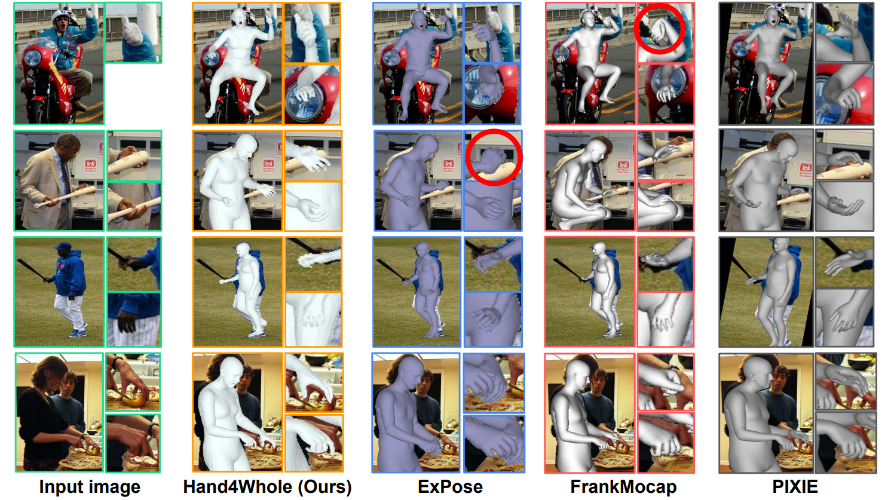
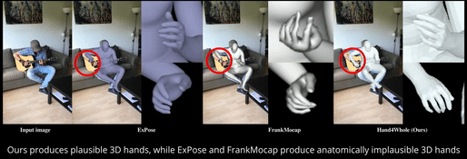
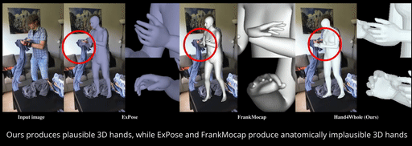
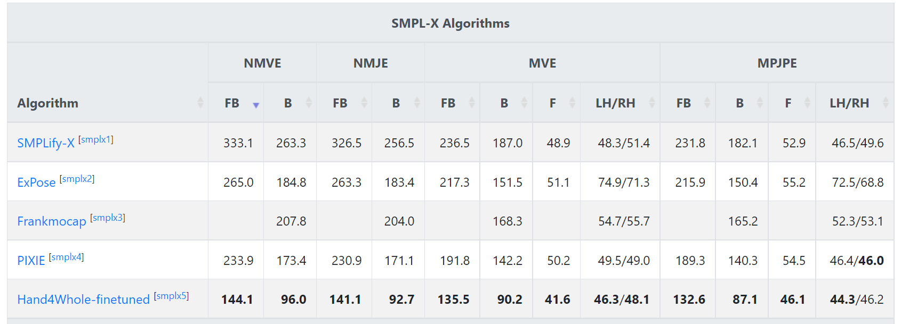
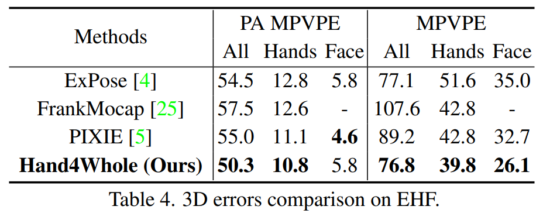
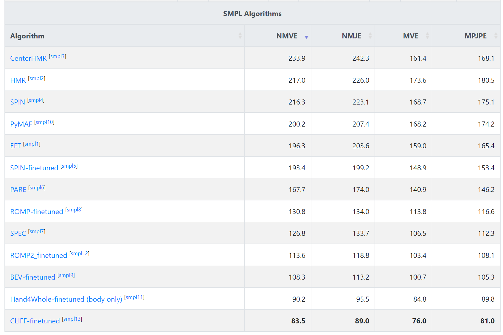
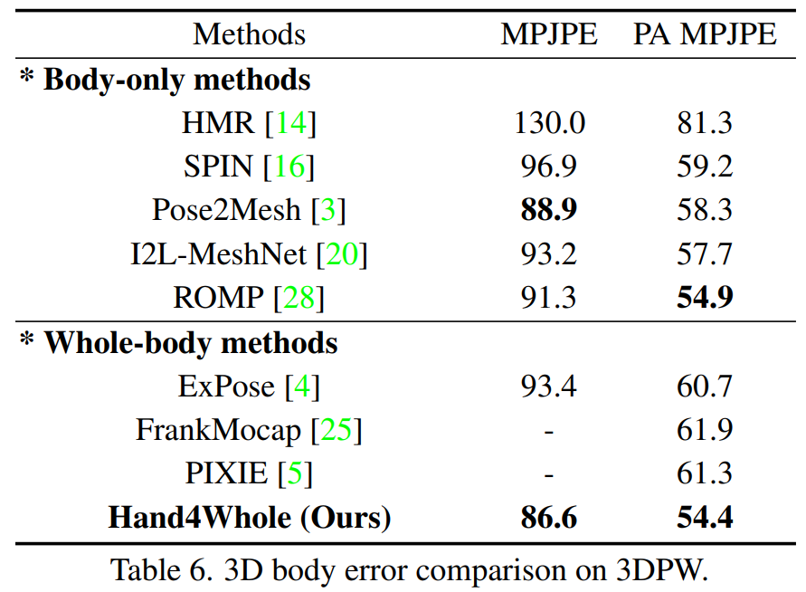
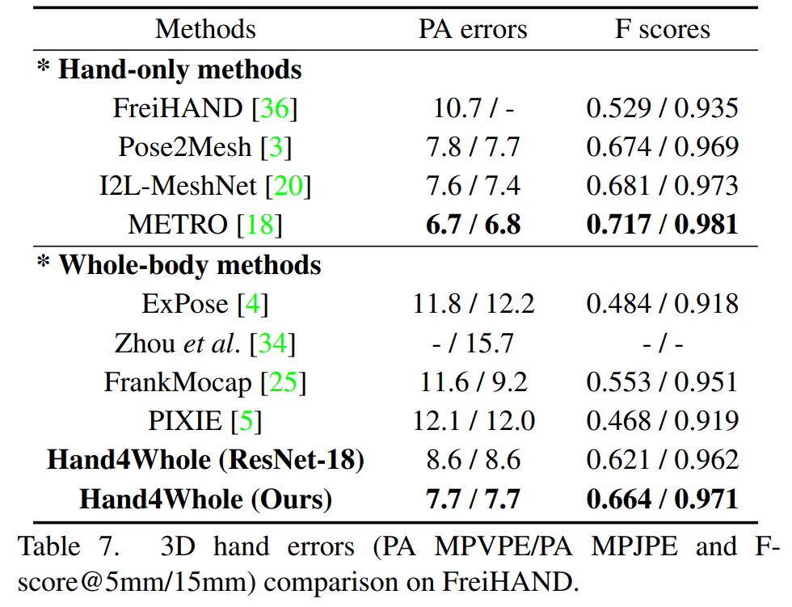

# **Accurate 3D Hand Pose Estimation for Whole-Body 3D Human Mesh Estimation (Hand4Whole codes)**
  
<p align="center">  
  
</p> 

<p align="middle">

</p>

High-resolution video link: [here](https://youtu.be/Ym_CH8yxBso)


## Introduction  
This repo is official **[PyTorch](https://pytorch.org)** implementation of **[**Accurate 3D Hand Pose Estimation for Whole-Body 3D Human Mesh Estimation** (CVPRW 2022 Oral.)](https://arxiv.org/abs/2011.11534)**. **This repo contains whole-body codes**. For the body-only, hand-only, and face-only codes, visit [here](https://github.com/mks0601/Hand4Whole_RELEASE/tree/Pose2Pose).
  
  
## Quick demo  
* Slightly change `torchgeometry` kernel code following [here](https://github.com/mks0601/I2L-MeshNet_RELEASE/issues/6#issuecomment-675152527).
* Download the pre-trained Hand4Whole from [here](https://drive.google.com/file/d/1r0LfI_ATI8NmhOj4y8eqLlEDdNQj5SCV/view?usp=sharing).
* Prepare `input.png` and pre-trained snapshot at `demo` folder.
* Prepare `human_model_files` folder following below `Directory` part and place it at `common/utils/human_model_files`.
* Go to any of `demo` folders and edit `bbox`.
* Run `python demo.py --gpu 0`.
* If you run this code in ssh environment without display device, do follow:
```
1、Install oemesa follow https://pyrender.readthedocs.io/en/latest/install/
2、Reinstall the specific pyopengl fork: https://github.com/mmatl/pyopengl
3、Set opengl's backend to egl or osmesa via os.environ["PYOPENGL_PLATFORM"] = "egl"
```

## Directory  
### Root  
The `${ROOT}` is described as below.  
```  
${ROOT}  
|-- data  
|-- demo
|-- main  
|-- tool
|-- output  
|-- common
|   |-- utils
|   |   |-- human_model_files
|   |   |   |-- smpl
|   |   |   |   |-- SMPL_NEUTRAL.pkl
|   |   |   |-- smplx
|   |   |   |   |-- MANO_SMPLX_vertex_ids.pkl
|   |   |   |   |-- SMPL-X__FLAME_vertex_ids.npy
|   |   |   |   |-- SMPLX_NEUTRAL.pkl
|   |   |   |   |-- SMPLX_to_J14.pkl
|   |   |   |-- mano
|   |   |   |   |-- MANO_LEFT.pkl
|   |   |   |   |-- MANO_RIGHT.pkl
|   |   |   |-- flame
|   |   |   |   |-- flame_dynamic_embedding.npy
|   |   |   |   |-- flame_static_embedding.pkl
|   |   |   |   |-- FLAME_NEUTRAL.pkl
```  
* `data` contains data loading codes and soft links to images and annotations directories.  
* `demo` contains demo codes.
* `main` contains high-level codes for training or testing the network.  
* `tool` contains pre-processing codes of AGORA and pytorch model editing codes.
* `output` contains log, trained models, visualized outputs, and test result.  
* `common` contains kernel codes for Hand4Whole.  
* `human_model_files` contains `smpl`, `smplx`, `mano`, and `flame` 3D model files. Download the files from [[smpl]](https://smpl.is.tue.mpg.de/) [[smplx]](https://smpl-x.is.tue.mpg.de/) [[SMPLX_to_J14.pkl]](https://github.com/vchoutas/expose#preparing-the-data) [[mano]](https://mano.is.tue.mpg.de/) [[flame]](https://flame.is.tue.mpg.de/).
  
### Data  
You need to follow directory structure of the `data` as below.  
```  
${ROOT}  
|-- data  
|   |-- AGORA
|   |   |-- data
|   |   |   |-- AGORA_train.json
|   |   |   |-- AGORA_validation.json
|   |   |   |-- AGORA_test_bbox.json
|   |   |   |-- 1280x720
|   |   |   |-- 3840x2160
|   |-- EHF
|   |   |-- data
|   |   |   |-- EHF.json
|   |-- Human36M  
|   |   |-- images  
|   |   |-- annotations  
|   |-- MPII
|   |   |-- data
|   |   |   |-- images
|   |   |   |-- annotations
|   |-- MPI_INF_3DHP
|   |   |-- data
|   |   |   |-- images_1k
|   |   |   |-- MPI-INF-3DHP_1k.json
|   |   |   |-- MPI-INF-3DHP_camera_1k.json
|   |   |   |-- MPI-INF-3DHP_joint_3d.json
|   |   |   |-- MPI-INF-3DHP_SMPL_NeuralAnnot.json
|   |-- MSCOCO  
|   |   |-- images  
|   |   |   |-- train2017  
|   |   |   |-- val2017  
|   |   |-- annotations 
|   |-- PW3D
|   |   |-- data
|   |   |   |-- 3DPW_train.json
|   |   |   |-- 3DPW_validation.json
|   |   |   |-- 3DPW_test.json
|   |   |-- imageFiles

```

* Download AGORA parsed data [[data](https://drive.google.com/drive/folders/18CWsL28e8v50rqEbYMoU4yHHWoGJdpg_?usp=sharing)][[parsing codes](tool/AGORA)]
* Download EHF parsed data [[data](https://drive.google.com/file/d/1Ji2PuB2HYQzRpQ016LwSSLguFMezQqOI/view?usp=sharing)]
* Download Human3.6M parsed data and SMPL-X parameters [[data](https://drive.google.com/drive/folders/1r0B9I3XxIIW_jsXjYinDpL6NFcxTZart?usp=sharing)][[SMPL-X parameters from NeuralAnnot](https://drive.google.com/drive/folders/19ifIQtAB3ll8d37-kerL1eQWp31mOwJM?usp=sharing)]
* Download MPII parsed data and SMPL-X parameters [[data](https://drive.google.com/drive/folders/1rrL_RxhwQgwhq5BU1iIRPwl285B_KTpU?usp=sharing)][[SMPL-X parameters from NeuralAnnot](https://drive.google.com/file/d/1alkKvhkqQGqriKst83uS-kUG7v6SkM7W/view?usp=sharing)]
* Download MPI-INF-3DHP parsed data and SMPL-X parameters [[data](https://drive.google.com/drive/folders/1wQbHEXPv-WH1sNOLwdfMVB7OWsiJkq2M?usp=sharing)][[SMPL-X parameters from NeuralAnnot](https://drive.google.com/file/d/1ADOJlaqaBDjZ3IEgrgLTQwNf6iHd-rGH/view?usp=sharing)]
* Download MSCOCO data and SMPL-X parameters [[data](https://github.com/jin-s13/COCO-WholeBody)][[SMPL-X parameters from NeuralAnnot](https://drive.google.com/file/d/1RVJiI2Y1TjiAPcRnDZk5CX5L7Vehfinm/view?usp=sharing)]
* Download 3DPW parsed data [[data](https://drive.google.com/drive/folders/1HByTBsdg_A_o-d89qd55glTl44ya3dOs?usp=sharing)]
* All annotation files follow [MSCOCO format](http://cocodataset.org/#format-data). If you want to add your own dataset, you have to convert it to [MSCOCO format](http://cocodataset.org/#format-data).  
  
  
### Output  
You need to follow the directory structure of the `output` folder as below.  
```  
${ROOT}  
|-- output  
|   |-- log  
|   |-- model_dump  
|   |-- result  
|   |-- vis  
```  
* Creating `output` folder as soft link form is recommended instead of folder form because it would take large storage capacity.  
* `log` folder contains training log file.  
* `model_dump` folder contains saved checkpoints for each epoch.  
* `result` folder contains final estimation files generated in the testing stage.  
* `vis` folder contains visualized results.  


## Running Hand4Whole
* In the `main/config.py`, you can change datasets to use.  

### Train 
The training consists of three stages.

#### 1st: pre-train Hand4Whole 
In the `main` folder, run  
```bash  
python train.py --gpu 0-3 --lr 1e-4 --continue
```  
to train Hand4Whole on the GPU 0,1,2,3. `--gpu 0,1,2,3` can be used instead of `--gpu 0-3`. To train Hand4Whole from the pre-trained 2D human pose estimation network, download [this](https://drive.google.com/file/d/1E_gEoY7pS5BTNcpxeM1IftkkboPKebs-/view?usp=sharing) and place it at `tool`. Then, run `python convert_simple_to_pose2pose.py`, which produces `snapshot_0.pth.tar`. Finally, place `snapshot_0.pth.tar` to `output/model_dump`.

#### 2nd: pre-train hand-only Pose2Pose
Download pre-trained hand-only Pose2Pose from [here](https://drive.google.com/file/d/15wYR8psO2U3ZhFYQEH1-DWc81XkWvK2Y/view?usp=sharing).
Place the hand-only Pose2Pose to `tool/snapshot_12_hand.pth.tar`.
Also, place the pre-trained Hand4Whole of the first stage to `tool/snapshot_6_all.pth.tar`.
Then, go to `tool` folder and run `python merge_hand_to_all.py`.
Place the generated `snapshot_0.pth.tar` to `output/model_dump`.


Or, you can pre-train hand-only Pose2Pose by yourself.
Switch to [Pose2Pose branch](https://github.com/mks0601/Hand4Whole_RELEASE/tree/Pose2Pose) and train hand-only Pose2Pose on MSCOCO, FreiHAND, InterHand2.6M.


#### 3rd: combine pre-trained Hand4Whole and hand-only Pose2Pose and fine-tune it
Move `snapshot_6.pth.tar` of the 1st stage to `tool/snapshot_6_all.pth.tar`.
Then, move `snapshot_12.pth.tar` of the 2nd stage to `tool/snapshot_12_hand.pth.tar`.
Run `python merge_hand_to_all.py` at the `tool` folder.
Move generated `snapshot_0.pth.tar` to `output/model_dump`. 
In the `main` folder, run  
```bash  
python train.py --gpu 0-3 --lr 1e-5 --continue
```  
to train Hand4Whole on the GPU 0,1,2,3. `--gpu 0,1,2,3` can be used instead of `--gpu 0-3`. 

  
### Test  
Place trained model at the `output/model_dump/`. 
  
In the `main` folder, run  
```bash  
python test.py --gpu 0-3 --test_epoch 6
```  
to test Hand4Whole on the GPU 0,1,2,3 with60th epoch trained model. `--gpu 0,1,2,3` can be used instead of `--gpu 0-3`.  
  
## Models
* Download Hand4Whole trained on H36M+MPII+MSCOCO from [here](https://drive.google.com/file/d/1r0LfI_ATI8NmhOj4y8eqLlEDdNQj5SCV/view?usp=sharing).
* Download Hand4Whole fine-tuned on AGORA (without gender classification) from [here](https://drive.google.com/file/d/10IEblHAeNRXQ0WFXMCRwlVShoEoWcvIl/view?usp=sharing). 
* To fine-tine Hand4Whole on AGORA, move `snapshot_6.pth.tar`, generated after the 3rd training stage, to `tool` and run `python reset_epoch.py`. Then, move the generated `snapshot_0.pth.tar` to `output/model_dump` and run `python train.py --gpu 0-3 --lr 1e-4` after changing `trainset_3d=['AGORA']`, `trainset_2d[]`, `testset='AGORA`, `lr_dec_epoch=[40,60]`, and `end_epoch = 70` at `config.py`.

## Results

### 3D whole-body results
<p align="middle">


</p>

### 3D body-only and hand-only results
For the 3D body-only and hand-only codes, visit [here](https://github.com/mks0601/Hand4Whole_RELEASE/tree/Pose2Pose).
<p align="middle">

</p>


<p align="middle">


</p>


## Troubleshoots
* `RuntimeError: Subtraction, the '-' operator, with a bool tensor is not supported. If you are trying to invert a mask, use the '~' or 'logical_not()' operator instead.`: Go to [here](https://github.com/mks0601/I2L-MeshNet_RELEASE/issues/6#issuecomment-675152527)

## Reference  
```  
@InProceedings{Moon_2022_CVPRW_Hand4Whole,  
author = {Moon, Gyeongsik and Choi, Hongsuk and Lee, Kyoung Mu},  
title = {Accurate 3D Hand Pose Estimation for Whole-Body 3D Human Mesh Estimation},  
booktitle = {Computer Vision and Pattern Recognition Workshop (CVPRW)},  
year = {2022}  
}  
```
